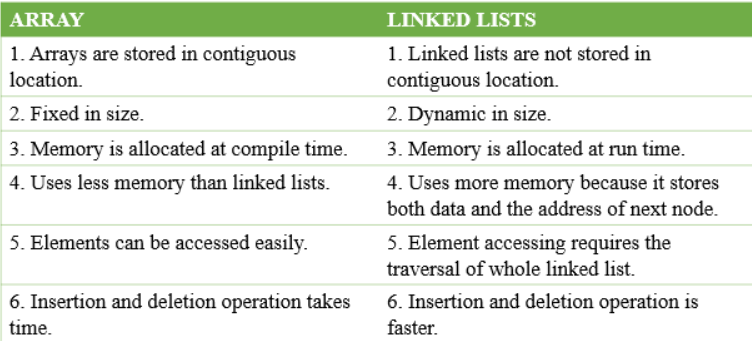

# Data Structures And Algorithms
## Array 
  1. **WHAT**
     
    - Store elements in contiguous memory locations, resulting in easily calculable addresses for the elements stored and this allows faster access to an element at a specific index
  2. **WHY**
     
    - Arrays store multiple data of similar types with the same name.
     
    - It allows random access to elements.
     
    - As the array is of fixed size and stored in contiguous memory locations there is no memory shortage or overflow
     
    - The array is static in nature. Once the size of the array is declared then we can’t modify it.
      
    - Insertion and deletion operations are difficult in an array as elements are stored in contiguous memory locations and the shifting operations are costly.
      
    - The number of elements that have to be stored in an array should be known in advance
      
## Linked List 
 
  1. **WHAT** 
   
    - Line near data structure
 
    - A linked list consists of nodes where each node contains a data field and a reference(link) to the next node in the list ( data, pointer ).  
  2. **WHY**
    
    - Having a lots of advantages: Dynamic, Quick insertion, Quick deletion…Linked lists are used for dynamic memory allocation which means effective memory utilization hence, no memory wastage
  3. **WHEN**  
    - Linked Lists are used to implement **stacks** and **queues**.
    - It is used for the various representations of trees and graphs.
    - It is used in dynamic memory allocation
## Array VS Linked List
  
## Double Linked List
   1. **WHAT**  
    - A Doubly Linked List (DLL) contains an extra pointer, typically called the previous pointer, together with the next pointer and data which are there in the singly linked list
   2. **WHY**  
    - A DLL can be traversed in both forward and backward directions.  
    - The delete operation in DLL is more efficient if a pointer to the node to be deleted is given. 
    - We can quickly insert a new node before a given node  
   3. **WHEN**  
    - It is used in the navigation systems where front and back navigation is required.  
    - It is used by the browser to implement backward and forward navigation of visited web pages that is a back and forward button  
    - It is also used by various applications to implement undo and redo functionality  
   4. **Stack VS Queue**  
        | Stack  | Queue |
        | -------- | -------- |
        | Stacks are based on the LIFO principle, i.e., the element inserted at the last, is the first element to come out of the list. | Queues are based on the FIFO principle, i.e., the element inserted at the first, is the first element to come out of the list. |
        |Insertion and deletion in stacks takes place only from one end of the list called the top. | Insertion and deletion in queues takes place from the opposite ends of the list. The insertion takes place at the rear of the list and the deletion takes place from the front of the list. |
        | Insert operation is called push operation.	 | Insert operation is called enqueue operation.|
        | Delete operation is called pop operation.	 | Delete operation is called dequeue operation. |
        | In stacks we maintain only one pointer to access the list, called the top, which always points to the last element present in the list. | In queues we maintain two pointers to access the list. The front pointer always points to the first element inserted in the list and is still present, and the rear pointer always points to the last inserted element. |

   5. **Hash Table (Hash Map)**  
    - Hash table is a data structure that maps keys to values using a special function called a hash function. Hash stores the data in an associative manner in an array where each data value has its own unique index.  
    - Applications of hash : count same characters in a string  
    - Advantages: quick search  
   6. **Heap**  
    - Max-Heap: In this heap, the value of the root node must be the greatest among all its child nodes and the same thing must be done for its left ans right sub-tree also.  
    - Min-Heap: In this heap, the value of the root node must be the smallest among all its child nodes and the same thing must be done for its left ans right sub-tree also.