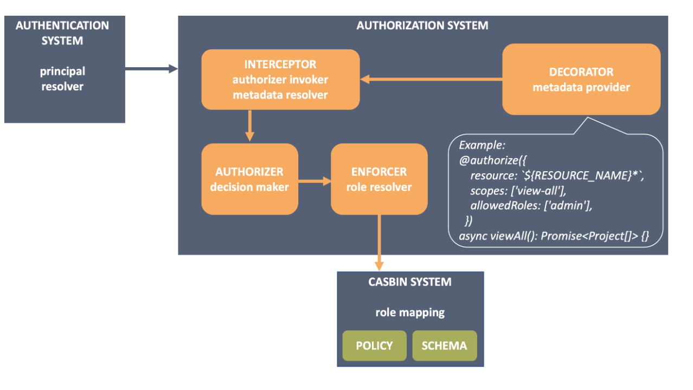

# LOOPBACK
## Overview
[LoopBack](https://loopback.io/) is a highly extensible, open source Node.js framework based on Express that enables you to quickly create dynamic end-to-end REST APIs and connect to backend systems such as databases and **SOAP or REST** services.

- Create dynamic end-to-end REST APIs with little or no coding.
- Access data from Oracle, MySQL, PostgreSQL, MS SQL Server, MongoDB, SOAP and other REST APIs.
- Incorporate model relationships and access controls for complex APIs.
- Use built-in push, geolocation, and file services for mobile apps.
- Easily create client apps using Android, iOS, and JavaScript SDKs.
- Run your application on-premises or in the cloud.

 

## Authentication - Authorization
Security is of paramount importance when developing a web or mobile application and usually consists of two distinct pieces:Authentication and Authorization <br>
- Authentication is a process of verifying user/entity to the system, which enables identified/validated access to the protected routes. <br>
- Authorization is a process of deciding if a user can perform an action on a protected resource. <br>



## MIGRATION
In LoopBack, auto-migration helps the user create relational database schemas based on definitions of their models. Auto-migration can facilitate the synchronization of the backing database and models so that they match, such as in cases where the database needs to be changed in order to match the models. <br>
**Installation**
```js
npm install loopback4-migration
```

## *My assingment about : [LoopBack - Authentication and Authorization](https://github.com/hongna14/Avocada_CoffeeShop_BE)*

